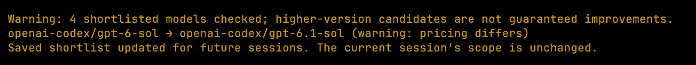

# Scoped model updater

A Pi extension that checks the session's current shortlist for higher-version candidates. `/model-updates` automatically updates a matching, explicit global saved shortlist for future sessions. `/model-updates dry-run` previews those changes without writing settings. A higher version is not a guarantee of a better model. The active model and current session's read-only scope are never changed.

## Install

Install the package from a local checkout with `pi install ./pi-model-updater`, or load it for one run with `pi -e ./pi-model-updater`. Pi 0.87.1 or newer is required for `ctx.scopedModels`.

## Use

Run `/model-updates` to refresh catalogs for providers in the current scoped shortlist, report the highest higher-version candidates, and automatically save unambiguous replacements for future sessions. Use `/model-updates dry-run` to preview without writing. Updates are saved only when the current scope exactly matches an explicit `enabledModels` list in global settings. Wildcards, CLI-only or otherwise mismatched scopes, project-level `enabledModels` overrides, missing models, ambiguous candidates, and refresh failures are left unchanged. The current session's scope remains unchanged; use a new session to pick up saved replacements. Provider authentication and discovery are delegated to Pi.

An empty scope is unrestricted selection and is not expanded into a catalog-wide search. Model IDs are matched only for the known GPT Sol/Luna (Codex), Gemini Flash (OpenCode), and DeepSeek Flash (OpenCode) families. Other families are left unsupported rather than guessed. Optional custom rules can be supplied as JSON in `PI_MODEL_UPDATE_RULES`, for example `[{"provider":"example","pattern":"^family-(\\d+(?:\\.\\d+)*)-flash$"}]`; capture group 1 must be the numeric version, and family identity is the exact model ID with that version replaced. Capability, context, pricing, and thinking-level differences are flagged when catalog metadata is available.

Optional startup checks are disabled by default. Set `PI_MODEL_UPDATES_STARTUP=1` to enable a best-effort, non-blocking startup check; notices are emitted only when candidates are found, with a 24-hour cooldown per extension runtime. In JSON/print modes reports are JSON on stdout, since those modes have no notification UI.

## Example

## Development

- `npm test` runs matcher and checker tests.
- `npm run typecheck` typechecks the package.
